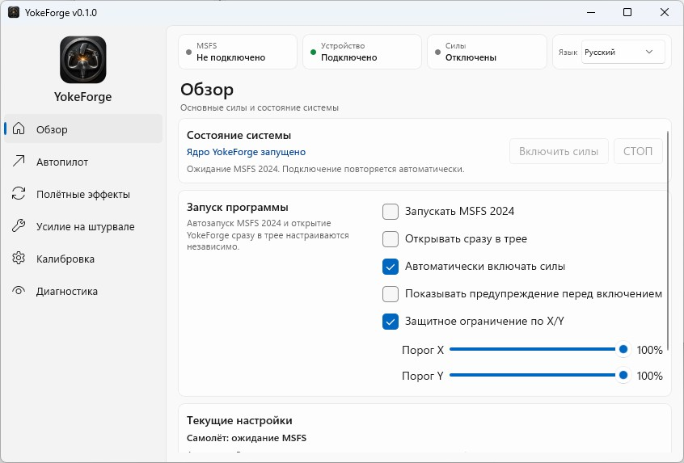
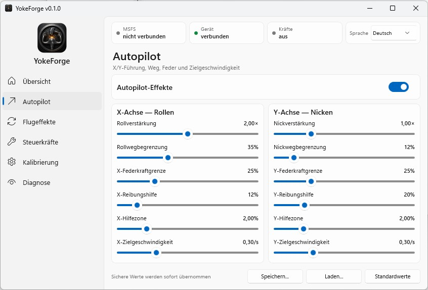
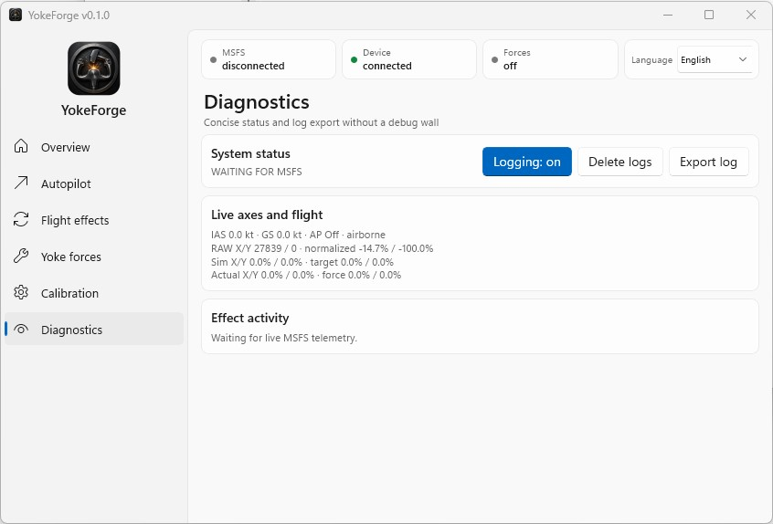

# YokeForge

[English](#readme-en) | [Русский](#readme-ru) | [Deutsch](#readme-de) | [Screenshots](#screenshots)

## English

**Force-feedback software for a flight yoke in Microsoft Flight Simulator 2024**

YokeForge is a Windows application that connects Microsoft Flight Simulator 2024 to a flight control device with Force Feedback.

YokeForge was created for a DIY flight yoke based on the Saitek Pro Flight Cessna Yoke System, using the electronics and force-feedback motors of a Microsoft SideWinder Force Feedback 2. The software was tested with a yoke assembled using materials published in the forum thread [“My Saitek FFB Yoke — a WIP”](https://forums.flightsimulator.com/t/my-saitek-ffb-yoke-a-wip/489386).

### What YokeForge does

YokeForge is designed to:

- receive flight data from Microsoft Flight Simulator 2024 through SimConnect;
- generate forces on the physical yoke based on flight data from the simulator;
- reproduce selected autopilot movements on the physical yoke;
- reproduce flight, aircraft, runway and ground-movement effects;
- calibrate the connected device;
- enable, disable and adjust the strength of individual effects;
- control roll and pitch force-feedback channels independently;
- protect the device from exceeding its permitted travel;
- disarm forces automatically when required for safety;
- provide a user interface in Russian, English and German.

**Translation note:** the Russian interface and documentation text is the source version. The English and German localizations were prepared using machine translation and may contain inaccuracies.

### Purpose and supported hardware

YokeForge was created as force-feedback control software for the author's own DIY yoke and as a replacement for existing solutions that did not provide the required behavior of the physical yoke while the autopilot was engaged.

The software was developed and tested for the following configuration:

- mechanical base and controls from a Saitek Pro Flight Cessna Yoke System;
- electronics and force-feedback motors from a Microsoft SideWinder Force Feedback 2;
- Windows 11 x64;
- Microsoft Flight Simulator 2024.

YokeForge is intended for the Microsoft SideWinder Force Feedback 2 and DIY devices built using its electronics, motors and force-feedback mechanism. The software has been tested only with this hardware foundation.

Support for other commercial joysticks and yokes is not claimed. Their compatibility has not been tested and cannot be guaranteed.

### Download and installation

The official YokeForge installer is available on the GitHub [Releases](https://github.com/AndrewZAP1977/YokeForge/releases) page.

Download the installer from the official repository and run it. Additional development or build tools are not required.

Do not use copies from unofficial mirrors, repackaged installers or modified executable files: their operation and safety cannot be guaranteed.

### Safety

Force-feedback hardware can move unexpectedly and may produce significant mechanical force.

Before first use:

1. Make sure the device is mechanically sound.
2. Complete full device calibration.
3. Keep hands and loose objects clear of moving parts during initial testing.
4. Be ready to disconnect motor power immediately.
5. Stop using the software immediately if the device produces unexpected, continuous or unsafe force.

Do not disable or attempt to bypass YokeForge safety limits, travel protection or automatic force disarming.

YokeForge is not certified aviation equipment and is not intended for controlling a real aircraft or for training on which flight safety depends.

### Reporting problems

Report bugs and suggest improvements through [GitHub Issues](https://github.com/AndrewZAP1977/YokeForge/issues). Before opening an issue, read [SUPPORT.md](SUPPORT.md#support-en).

All reports are treated as feedback and recommendations for the future development of the project. YokeForge is developed in the author's spare time, so there is no guarantee that every reported problem will be fixed, that suggestions will be implemented, or that replies will be provided within a particular time.

### Changelog

Information about changes in published YokeForge versions is provided in [CHANGELOG.md](CHANGELOG.md).

### License

YokeForge is proprietary software and is not distributed under an open-source license.

Read [LICENSE.txt](LICENSE.txt) before downloading, installing or using the software.

Third-party components are governed by their own license terms. Detailed information is provided in [THIRD-PARTY-NOTICES.txt](THIRD-PARTY-NOTICES.txt).

### Project independence and trademarks

YokeForge is an independent project. It is not affiliated with, endorsed by or officially supported by the owners of the software products and hardware mentioned in this document.

The names Microsoft, Microsoft Flight Simulator, Windows, SideWinder, Saitek, Pro Flight and Cessna are used solely to identify compatible software and hardware. All trademarks and registered trademarks belong to their respective owners.

[Back to languages](#yokeforge)

---

## Русский

**Программа силовой обратной связи для авиационного штурвала в Microsoft Flight Simulator 2024**

YokeForge — это приложение для Windows, которое связывает Microsoft Flight Simulator 2024 с устройством управления, имеющим силовую обратную связь Force Feedback.

YokeForge создана для самодельного авиационного штурвала на базе Saitek Pro Flight Cessna Yoke System с электроникой и моторами силовой обратной связи Microsoft SideWinder Force Feedback 2. Работа программы проверена на штурвале, собранном по материалам, опубликованным в теме форума [«My Saitek FFB Yoke — a WIP»](https://forums.flightsimulator.com/t/my-saitek-ffb-yoke-a-wip/489386).

### Что делает YokeForge

YokeForge предназначена для следующих задач:

- получение полётных данных из Microsoft Flight Simulator 2024 через SimConnect;
- формирование усилий на физическом штурвале на основе полётных данных симулятора;
- передача выбранных движений автопилота на физический штурвал;
- воспроизведение эффектов полёта, самолёта, взлётно-посадочной полосы и движения по земле;
- калибровка подключённого устройства;
- включение, отключение и регулировка силы отдельных эффектов;
- независимое управление силовой обратной связью по крену и тангажу;
- защита от выхода устройства за допустимый ход;
- автоматическое безопасное отключение сил;
- интерфейс на русском, английском и немецком языках.

**Примечание о переводе:** русский текст интерфейса и документации является исходным. Английская и немецкая локализации подготовлены с использованием машинного перевода и могут содержать неточности.

### Назначение и поддерживаемое оборудование

YokeForge создавалась как программа управления силовой обратной связью для собственного самодельного штурвала и как замена существующим решениям, которые не обеспечивали необходимую работу физического штурвала при включённом автопилоте.

Программа разработана и проверена для следующей конфигурации:

- механическая основа и органы управления от Saitek Pro Flight Cessna Yoke System;
- электроника и моторы силовой обратной связи Microsoft SideWinder Force Feedback 2;
- Windows 11 x64;
- Microsoft Flight Simulator 2024.

YokeForge предназначена для Microsoft SideWinder Force Feedback 2 и самодельных устройств, построенных с использованием его электроники, моторов и механики Force Feedback. Программа тестировалась только с такой аппаратной основой.

Поддержка других коммерческих джойстиков и штурвалов не заявляется. Их совместимость не проверялась и не может гарантироваться.

### Загрузка и установка

Официальный установщик YokeForge доступен на странице GitHub [Releases](https://github.com/AndrewZAP1977/YokeForge/releases).

Скачайте установщик из официального репозитория и запустите его. Дополнительные средства разработки и инструменты сборки не требуются.

Не используйте копии с неофициальных зеркал, перепакованные установщики или изменённые исполняемые файлы: их работа и безопасность не гарантируются.

### Безопасность

Оборудование с силовой обратной связью может двигаться неожиданно и создавать значительное механическое усилие.

Перед первым запуском:

1. Убедитесь в исправности механики устройства.
2. Выполните полную калибровку устройства.
3. Во время первой проверки держите руки и посторонние предметы подальше от движущихся частей.
4. Будьте готовы немедленно отключить питание моторов.
5. Немедленно прекратите использование программы, если устройство создаёт неожиданное, постоянное или опасное усилие.

Не отключайте и не пытайтесь обходить защитные ограничения YokeForge, защиту рабочего хода и автоматическое отключение сил.

YokeForge не является сертифицированным авиационным оборудованием и не предназначена для управления реальным воздушным судном или для обучения, от которого зависит безопасность полётов.

### Сообщение о проблемах

Сообщайте об ошибках и предлагайте улучшения через [GitHub Issues](https://github.com/AndrewZAP1977/YokeForge/issues). Перед созданием обращения ознакомьтесь с [SUPPORT.md](SUPPORT.md#support-ru).

Все обращения рассматриваются как обратная связь и рекомендации для дальнейшего развития проекта. YokeForge развивается автором в свободное время, поэтому исправление каждой обнаруженной проблемы, реализация предложений и сроки ответа не гарантируются.

### История изменений

Сведения об изменениях в опубликованных версиях YokeForge приведены в [CHANGELOG.md](CHANGELOG.md).

### Лицензия

YokeForge является проприетарным программным обеспечением и не распространяется по лицензии с открытым исходным кодом.

Перед загрузкой, установкой или использованием программы ознакомьтесь с [LICENSE.txt](LICENSE.txt).

Сторонние компоненты регулируются условиями их собственных лицензий. Подробная информация приведена в [THIRD-PARTY-NOTICES.txt](THIRD-PARTY-NOTICES.txt).

### Независимость проекта и товарные знаки

YokeForge является независимым проектом. Он не связан с правообладателями упомянутых программных продуктов и оборудования, не одобрен ими и не получает от них официальную поддержку.

Названия Microsoft, Microsoft Flight Simulator, Windows, SideWinder, Saitek, Pro Flight и Cessna используются исключительно для идентификации совместимого программного обеспечения и оборудования. Все товарные знаки и зарегистрированные товарные знаки принадлежат их соответствующим правообладателям.

[К выбору языка](#yokeforge)

---

## Deutsch

**Force-Feedback-Software für ein Steuerhorn in Microsoft Flight Simulator 2024**

YokeForge ist eine Windows-Anwendung, die Microsoft Flight Simulator 2024 mit einem Flugsteuergerät mit Force Feedback verbindet.

YokeForge wurde für ein DIY-Steuerhorn auf Basis des Saitek Pro Flight Cessna Yoke System mit der Elektronik und den Force-Feedback-Motoren eines Microsoft SideWinder Force Feedback 2 entwickelt. Die Funktion der Software wurde mit einem Steuerhorn geprüft, das anhand der im Forenthread [„My Saitek FFB Yoke — a WIP“](https://forums.flightsimulator.com/t/my-saitek-ffb-yoke-a-wip/489386) veröffentlichten Materialien gebaut wurde.

### Funktionen von YokeForge

YokeForge ist für folgende Aufgaben vorgesehen:

- Empfangen von Flugdaten aus Microsoft Flight Simulator 2024 über SimConnect;
- Erzeugen von Kräften am physischen Steuerhorn auf Grundlage der Flugdaten des Simulators;
- Übertragen ausgewählter Autopilotbewegungen auf das physische Steuerhorn;
- Wiedergeben von Flug-, Flugzeug-, Start- und Landebahn- sowie Bodenbewegungseffekten;
- Kalibrieren des angeschlossenen Geräts;
- Aktivieren, Deaktivieren und Einstellen der Stärke einzelner Effekte;
- getrennte Steuerung der Force-Feedback-Kanäle für Roll- und Nickachse;
- Schutz des Geräts vor dem Überschreiten des zulässigen Bewegungswegs;
- automatische sichere Abschaltung der Kräfte;
- Benutzeroberfläche in Russisch, Englisch und Deutsch.

**Hinweis zur Übersetzung:** Der russische Text der Benutzeroberfläche und der Dokumentation ist die Ausgangsversion. Die englische und deutsche Lokalisierung wurden mithilfe maschineller Übersetzung erstellt und können Ungenauigkeiten enthalten.

### Zweck und unterstützte Hardware

YokeForge wurde als Force-Feedback-Steuerungssoftware für das eigene DIY-Steuerhorn des Autors und als Ersatz für bestehende Lösungen entwickelt, die bei aktiviertem Autopiloten nicht das erforderliche Verhalten des physischen Steuerhorns ermöglichten.

Die Software wurde für folgende Konfiguration entwickelt und getestet:

- mechanische Grundlage und Bedienelemente des Saitek Pro Flight Cessna Yoke System;
- Elektronik und Force-Feedback-Motoren eines Microsoft SideWinder Force Feedback 2;
- Windows 11 x64;
- Microsoft Flight Simulator 2024.

YokeForge ist für den Microsoft SideWinder Force Feedback 2 und DIY-Geräte vorgesehen, die dessen Elektronik, Motoren und Force-Feedback-Mechanik verwenden. Die Software wurde ausschließlich mit dieser Hardwaregrundlage getestet.

Die Unterstützung anderer kommerzieller Joysticks und Steuerhörner wird nicht zugesichert. Ihre Kompatibilität wurde nicht geprüft und kann nicht garantiert werden.

### Download und Installation

Das offizielle YokeForge-Installationsprogramm ist auf der GitHub-Seite [Releases](https://github.com/AndrewZAP1977/YokeForge/releases) verfügbar.

Laden Sie das Installationsprogramm aus dem offiziellen Repository herunter und führen Sie es aus. Zusätzliche Entwicklungs- oder Build-Werkzeuge sind nicht erforderlich.

Verwenden Sie weder Kopien von inoffiziellen Spiegelservern noch neu verpackte Installationsprogramme oder veränderte ausführbare Dateien: Ihre Funktion und Sicherheit können nicht garantiert werden.

### Sicherheit

Force-Feedback-Hardware kann sich unerwartet bewegen und erhebliche mechanische Kräfte erzeugen.

Vor der ersten Verwendung:

1. Vergewissern Sie sich, dass die Mechanik des Geräts einwandfrei ist.
2. Führen Sie eine vollständige Kalibrierung des Geräts durch.
3. Halten Sie während der ersten Prüfung Hände und lose Gegenstände von beweglichen Teilen fern.
4. Seien Sie darauf vorbereitet, die Motorstromversorgung sofort zu trennen.
5. Beenden Sie die Verwendung der Software sofort, wenn das Gerät unerwartete, dauerhafte oder gefährliche Kräfte erzeugt.

Deaktivieren oder umgehen Sie nicht die Sicherheitsgrenzen, den Wegschutz oder die automatische Kraftabschaltung von YokeForge.

YokeForge ist keine zertifizierte Luftfahrtausrüstung und ist nicht für die Steuerung eines realen Luftfahrzeugs oder für Schulungen vorgesehen, von denen die Flugsicherheit abhängt.

### Probleme melden

Melden Sie Fehler und schlagen Sie Verbesserungen über [GitHub Issues](https://github.com/AndrewZAP1977/YokeForge/issues) vor. Lesen Sie vor dem Erstellen eines Issues [SUPPORT.md](SUPPORT.md#support-de).

Alle Meldungen werden als Rückmeldungen und Empfehlungen für die weitere Entwicklung des Projekts betrachtet. YokeForge wird vom Autor in seiner Freizeit entwickelt; daher werden weder die Behebung jedes gemeldeten Problems noch die Umsetzung von Vorschlägen oder bestimmte Antwortzeiten garantiert.

### Änderungsverlauf

Informationen zu Änderungen in veröffentlichten YokeForge-Versionen finden Sie in [CHANGELOG.md](CHANGELOG.md).

### Lizenz

YokeForge ist proprietäre Software und wird nicht unter einer Open-Source-Lizenz vertrieben.

Lesen Sie [LICENSE.txt](LICENSE.txt), bevor Sie die Software herunterladen, installieren oder verwenden.

Komponenten von Drittanbietern unterliegen ihren eigenen Lizenzbedingungen. Ausführliche Informationen finden Sie in [THIRD-PARTY-NOTICES.txt](THIRD-PARTY-NOTICES.txt).

### Unabhängigkeit des Projekts und Marken

YokeForge ist ein unabhängiges Projekt. Es ist weder mit den Eigentümern der in diesem Dokument genannten Softwareprodukte und Hardware verbunden noch wird es von ihnen unterstützt oder offiziell empfohlen.

Die Namen Microsoft, Microsoft Flight Simulator, Windows, SideWinder, Saitek, Pro Flight und Cessna werden ausschließlich zur Kennzeichnung kompatibler Software und Hardware verwendet. Alle Marken und eingetragenen Marken gehören ihren jeweiligen Eigentümern.

[Zur Sprachauswahl](#yokeforge)

---

## Screenshots

### Overview / Обзор / Übersicht

### Autopilot / Автопилот

### Diagnostics / Диагностика / Diagnose

[Back to languages / К выбору языка / Zur Sprachauswahl](#yokeforge)
